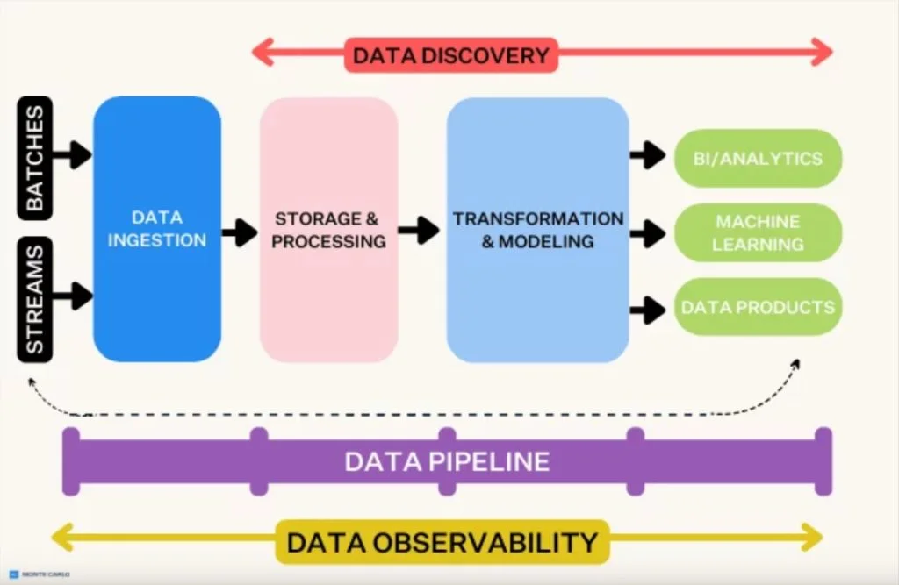
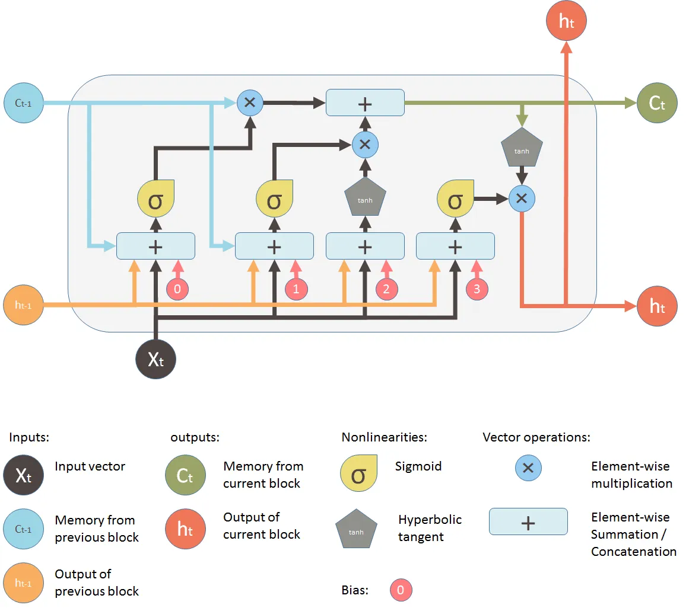
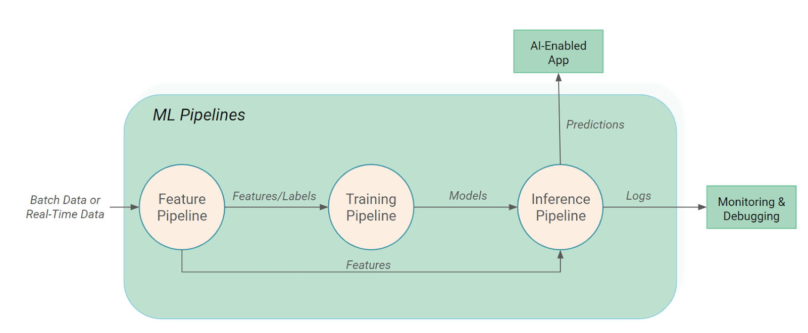

# Seismic Detection
We developed algorithmic and machine learning models to identify seismic events in real data from the Apollo missions and the Mars InSight mission, minimizing the transmission of unnecessary information. For the Moon, we applied traditional signal processing techniques like Fast Fourier Transform and spectrogram analysis to detect seismic events, achieving reasonable accuracy. For Mars, where the signal-to-noise ratio is lower, we used advanced machine learning, specifically a long short term memory model, to handle the time-series nature of seismic data. This model captures subtle temporal patterns and dependencies, helping to predict the timing of seismic events. Though the accuracy of the machine learning model was lower due to potential noise sensitivity, it offers a scalable solution that can be improved with further refinement. Our models help improve seismic event detection and enhance data efficiency and advance our understanding of planetary activity. 

## Additional data
This Google Drive contains data that we used for our project. 
[https://docs.google.com/document/d/11yPrLIqcA9FDIywRGnuaOL1iYACTb3Usb5KmRUoA8ms/edit?usp=sharing](https://drive.google.com/drive/folders/1UMmU471yz6-G3Kaj_hpo8AOv1dRT_c5i?usp=sharing)

## Project Details
Planetary seismology missions face significant challenges with power limitations, particularly when transmitting continuous seismic data from distant planets back to Earth. Given that only a fraction of the data is scientifically useful, optimizing data transmission is critical. This project aims to address this issue by developing a computer program capable of distinguishing between noise and scientifically valuable seismic signals. By analyzing real data from the Apollo missions and the Mars Interior Exploration using Seismic Investigations, the goal is to identify and extract seismic events, minimizing the need to send back unnecessary information. 

In developing our project, we used Google Colab as the primary development environment and Python as the primary programming language. We decided to use different algorithms for Moon and Mars predictions, because of the differences in signal-to-noise ratio and the amount of data that was available for training. 
We created a webpage to present our results, and to display our results more efficiently, we created interactive plots for visualization. For creating interactive plots, we used Holoviews, a high-level data visualization library that simplifies the creation of interactive plots, and Panel, a powerful tool for building interactive web applications and dashboards in Python. The interactive plot displays continuous seismic records as curves over time with event markers. By hovering on the curve, users can retrieve information about the relative time and amplitude at that point. The user can also zoom in and out on specific sections of the data using the zoom box, time sliders and amplitude sliders. After doing some visual manipulations, the user can also save the plot as an image.

We approached this challenge by the following methods:
### Algorithmic Predictive Models
  <ul>
    <li>
      These models apply an algorithm on the raw data to get the predicted value. These models differ from machine learning due to the fact that there is no need to train or test them, the model cannot gain more “knowledge”. One advantage is that it is simplistic and easy to implement, and there is no need to worry about overfitting. However, the model cannot learn from the data as well as machine learning or artificial intelligence models can.
    </li>
    <li>
      <strong>Fast Fourier Transform on Raw Data:</strong> Fast Fourier transform is a type of wave transform that extracts the amplitudes of the wave signal at each individual frequency (amplitude-frequency). This allows for increased signal to noise ratio as instead of the seismic activity occurring on the graph as a large blob, it instead appears as a single signal corresponding to the frequency of the wave that produces the seismic event. The model looks at the graph generated by the FFT, extracts the frequency with the maximum amplitude, and then maps it back to the time that it happened on the normal frequency-time graph, which gives our prediction. Some of the weaknesses that we found with this model was its inability to distinguish between brief high amplitude noise and a seismic event; it would regularly give a wrong prediction when such an event occurred. Further work on this model includes doing some denoising and filtering out outliers in amplitude to avoid false positives
    </li>
    

    <li>
      <strong>Spectrogram analysis on high-pass filtered data:</strong> High pass filter denoises the data by picking up the higher frequency signals and removes the lower frequency ones, which constitute most of the unwanted noise. The model then detects the highest power signal on the seismograph and returns the time that it occurred, which corresponds to a seismic event. This method has more success than the FFT model, due to the fact that high amplitude signals do not show up after denoising, which removes false positives. However, this model still has drawbacks due to the fact that only detecting the maximum power may not detect other clusters, which was the case when more than one seismic event occurred in one day. 
    </li>
    <li>
      <strong>Multi Prediction spectrogram analysis model:</strong> Same as the single prediction model, but to predict multiple seismic events, we check the spectrogram for power exceeding the 99th percentile, and make note of the times that these occur. We then do interval analysis on these time stamps, to find intervals where high energy readings are clustered, and mark it as a seismic event. This allows us to predict more than one seismic event in a single day. However, this causes false positives as even with denoising, noise can cause the model to incorrectly detect intervals of seismic activity. 
    </li>
    <li>
      <strong>Spectrogram cluster analysis:</strong> This method was used in the case of the mars data, due to the fact that high-pass filter denoising was not sufficient for the model to act on clear signals. Instead, we denoise and then find clusters of high power readings, and mark clusters instead on the spectrogram. We then take the highest power cluster and mark that as a prediction. A next step is to extend to generate predictions for multiple seismic events for one day. 
    </li>
  </ul>
  
### Machine Learning Model
  <ul>
    <li>
      An LSTM (Long Short-Term Memory) model is a highly suitable approach for the seismic event detection challenge for several reasons. Firstly, seismic data is a time-series signal, where each data point is dependent on the previous points. LSTM models are specifically designed to handle time-series data as they can maintain information across different time steps. In addition, LSTM models excel at capturing these long-term dependencies, unlike traditional RNNs (Recurrent Neural Networks), which suffer from vanishing gradients and struggle to retain information over longer periods. 
    </li>
    

    <li>
      Observing and testing with the provided training dataset, we noticed that the .mseed file contained a sampling rate and learned that there would be a reasonably large number of samples in a short amount of time, so we split each trace into small segments of 30 seconds. After splitting seismic traces into 30-second segments and extracting features (mean, max, skewness, etc.), we normalized the features and the target earthquake occurrence index. Using PyTorch, the LSTM model, with 64 hidden units, 2 layers, and a 0.2 dropout, was trained to predict the segment containing the earthquake. We used the Adam optimizer with MSELoss, training over 10 epochs with each trace processed independently, while allowing the model to learn the relationships between segments within each trace
    </li>
    

    <li>
      This approach allows the model to learn temporal dependencies between consecutive 30-second segments, which is crucial for capturing patterns that may indicate an upcoming earthquake. Also, by using an LSTM, the model can recognize subtle temporal patterns within the seismic data that simple feature-based models might miss. Ultimately, the goal is to improve the accuracy of predicting when an earthquake will occur by identifying the specific segment in which it starts. 
    </li>
  </ul>

## Developer Team
- [Luna Nguyen](https://github.com/lunanguyen)
- [Mathilda Lee](https://github.com/jkmathilda)  
- [Monica Trinh](https://github.com/monmon0)
- [Steven Gu](https://github.com/br0mabs)

